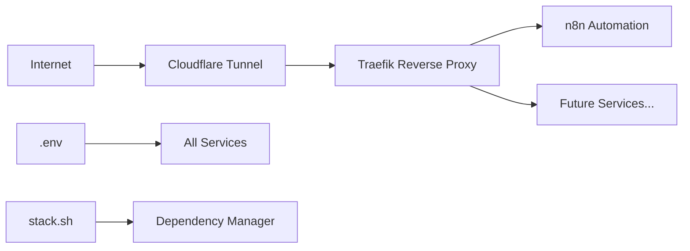

# 🏠⚡ Alchemist Homelab OS

> **The Intelligent Docker-Based Homelab Platform**

A comprehensive, self-hosted cloud platform that transforms your home server into a powerful automation and service hub. Built with **centralized configuration**, **intelligent dependency management**, and **dynamic service discovery**.

## 🌟 Philosophy

**"One Configuration, Infinite Possibilities"**

Alchemist Homelab OS eliminates the complexity of managing multiple Docker services by providing:
- **Centralized Environment Management** - All configuration in one place
- **Intelligent Service Dependencies** - Services start in the correct order automatically  
- **Dynamic URL Assignment** - Cloudflare tunnel URLs auto-populate across services
- **Extensible Architecture** - Add new services with minimal configuration

## 🏗️ Architecture



### Core Components:
- **🌐 Cloudflare Tunnel**: Zero-config secure HTTPS access (no port forwarding)
- **🔄 Traefik**: Intelligent reverse proxy with auto-discovery  
- **🤖 n8n**: Visual workflow automation platform
- **💾 PostgreSQL**: Reliable database for all applications
- **⚙️ Centralized Config**: Single `.env` file for all services
- **🧠 Smart Startup**: Automatic dependency resolution and URL assignment

## 📁 Project Structure

```
alchemist-homelab-os/
├── .env                       # 🎯 CENTRALIZED CONFIGURATION
├── docker-compose.yml         # 🎼 Master orchestration file
├── services/                  # 🏗️ Service definitions
│   ├── proxy/
│   │   ├── traefik/           # Reverse proxy & load balancer
│   │   └── cloudflared/       # Secure tunnel (no port forwarding)
│   ├── automation/
│   │   └── n8n/               # Visual workflow automation
│   ├── monitoring/            # 📊 Grafana + Prometheus stack
│   ├── storage/               # 💾 PostgreSQL database
│   ├── ai/                    # 🤖 Ollama local AI
│   ├── maintenance/           # 🔄 Watchtower auto-updater
│   ├── media/                 # 🎬 Entertainment services (optional)
│   └── security/              # 🔒 Authentication services (optional)
├── scripts/
│   ├── stack.sh               # 🧠 Intelligent startup manager
│   ├── manage.sh              # 🛠️ Service management utilities
│   └── new-service.sh         # 🚀 Service template generator
└── README.md
```

### 🎯 **Key Innovation: Centralized Configuration**

All service configuration lives in **one place** - the root `.env` file. No more hunting through multiple docker-compose files or managing scattered environment variables!

## 🚀 Service Ecosystem

### ✅ **Active Services**
| Service | Category | Description | Status |
|---------|----------|-------------|---------|
| **Traefik** | 🔄 Proxy | Multi-port reverse proxy (80, 88, 443, 8443, 8080) | ✅ Active |
| **Cloudflared** | 🌐 Tunnel | Zero-config secure external access | ✅ Active |
| **n8n** | 🤖 Automation | Visual workflow automation platform | ✅ Active |
| **Watchtower** | 🔄 Maintenance | Automatic container updates | ✅ Active |
| **Grafana** | 📊 Monitoring | Metrics dashboard and visualization | ✅ Active |
| **Prometheus** | 📈 Monitoring | Time-series metrics collection | ✅ Active |
| **PostgreSQL** | 💾 Storage | Reliable relational database server | ✅ Active |
| **Ollama** | 🤖 AI | Local AI API for LLM models | ✅ Active |

### 🎯 **Optional Services** 
Easily add with: `./scripts/new-service.sh <category> <name>`

| Category | Services | Purpose |
|----------|----------|---------|
| **📊 Monitoring** | Uptime Kuma, Netdata, AlertManager | Additional monitoring & alerting |
| **💾 Storage** | Nextcloud, MinIO, Redis | File storage & caching |
| **🎬 Media** | Plex, Jellyfin, Sonarr, Radarr | Entertainment & media management |
| **🔒 Security** | Authelia, Vaultwarden, Keycloak | Authentication & security |

### 🎯 **Intelligent Features**

- **🧠 Smart Dependencies**: Services start in correct order automatically
- **🔄 Dynamic URLs**: Cloudflare tunnel URLs auto-populate across services
- **⚙️ Zero-Config**: Cloudflared creates secure tunnels without router setup
- **🌐 Multi-Port**: Traefik supports multiple entry points for flexibility
- **🚀 Extensible**: Add services with pre-built templates

## 🚀 Quick Start

### Prerequisites

- **Docker** and **Docker Compose** installed
- **Git** for cloning the repository

### 🎯 **One-Command Startup** (Recommended)

```bash
# Clone the repository
git clone https://github.com/code-alchemist-dev/alchemist-homelab-os.git
cd alchemist-homelab-os

# Start everything with intelligent dependency management
./scripts/stack.sh start
```

The script will:
1. ✅ Check Docker and create the `web` network
2. 🚀 Start Traefik (reverse proxy foundation)
3. 🌐 Start Cloudflare tunnel (external access)
4. 🔍 Auto-detect the tunnel URL
5. 📝 Update configuration with the new URL
6. 🤖 Start n8n with the correct external URL
7. 🎊 Display all access points

### 🎉 **You'll see output like:**

```bash
🏠⚡ ALCHEMIST HOMELAB OS - INTELLIGENT STARTUP
=================================================

✅ Docker is running
🌐 Docker network exists: web
🚀 Starting services in dependency order...

✅ traefik started successfully  
✅ cloudflared-tunnel started successfully
🌐 Tunnel URL detected: https://your-unique-url.trycloudflare.com
📝 Environment files updated with tunnel URL
✅ n8n started with updated configuration

🎉 HOMELAB STARTUP COMPLETE!
==============================

🌐 Access Points:
   • n8n (Local):      http://localhost
   • n8n (External):   https://your-unique-url.trycloudflare.com  
   • Traefik Dashboard: http://localhost:8080
```

### 🛠️ **Manual Setup** (If needed)

```bash
# 1. Create Docker network
docker network create web

# 2. Start with master compose file
docker compose --env-file .env up -d

# 3. Get tunnel URL
./scripts/stack.sh url
```

## �️ Management Commands

### 🧠 **Intelligent Stack Management** (Recommended)

```bash
# Start all services with dependency management
./scripts/stack.sh start

# Stop all services gracefully  
./scripts/stack.sh stop

# Restart entire stack
./scripts/stack.sh restart

# Check service status
./scripts/stack.sh status

# Get current Cloudflare tunnel URL
./scripts/stack.sh url
```

### ⚙️ **Individual Service Management**

```bash
# Start specific services
./scripts/manage.sh start traefik
./scripts/manage.sh start n8n
./scripts/manage.sh start cloudflared

# Stop specific services
./scripts/manage.sh stop n8n

# View service logs
./scripts/manage.sh logs n8n

# Check overall status
./scripts/manage.sh status
```

### 🚀 **Service Expansion**

```bash
# Add a new service (e.g., Grafana monitoring)
./scripts/new-service.sh monitoring grafana

# This creates:
# services/monitoring/grafana/
# ├── docker-compose.yml    # Service template
# ├── .env                  # Environment template  
# └── README.md             # Service documentation
```

### 📊 **System Monitoring**

```bash
# Start monitoring stack (Grafana + Prometheus)
./scripts/manage.sh start monitoring

# Access monitoring dashboards
# Grafana: http://localhost:3000 (admin/admin)
# Prometheus: http://localhost:9090

# View all container status
docker ps --format "table {{.Names}}\t{{.Status}}\t{{.Ports}}"

# Check resource usage
docker stats

# View logs for troubleshooting
docker logs traefik
docker logs cloudflared-tunnel  
docker logs n8n
docker logs grafana
docker logs prometheus

# Follow logs in real-time
docker logs -f n8n
```

### 🔧 **Configuration Management**

```bash
# Edit centralized configuration
nano .env

# Apply configuration changes
./scripts/stack.sh restart

# View current environment
grep -v '^#' .env | grep -v '^$'
```

### 🌐 Access Points

### 🌍 **External Access** (via Cloudflare Tunnel)
- **🤖 n8n Interface**: `https://your-tunnel-url.trycloudflare.com`
- **🔗 Webhooks**: `https://your-tunnel-url.trycloudflare.com/webhook/...`
- **🔒 Automatic HTTPS**: SSL certificates managed by Cloudflare
- **🛡️ DDoS Protection**: Built-in security via Cloudflare

### 🏠 **Local Access**
- **🤖 n8n**: `http://localhost` (routed via Traefik)
- **📊 Traefik Dashboard**: `http://localhost:8080`
- **📊 Grafana Dashboard**: `http://localhost:3000`
- **📈 Prometheus**: `http://localhost:9090`
- **💾 PostgreSQL**: `localhost:5432`

### 🔌 **Multi-Port Support** 
Traefik supports multiple entry points for flexibility:
- **Port 80**: HTTP (primary)
- **Port 88**: Alternative HTTP  
- **Port 443**: HTTPS
- **Port 8443**: Alternative HTTPS
- **Port 8080**: Traefik Dashboard

### 🎯 **Dynamic URL Management**

The Cloudflare tunnel URL changes each restart, but **Alchemist Homelab OS handles this automatically**:

1. 🔍 **Auto-Detection**: `stack.sh` detects the new tunnel URL
2. 📝 **Auto-Update**: Updates `.env` configuration file
3. 🔄 **Auto-Restart**: Restarts n8n with the correct URL
4. ✅ **Zero Manual Work**: Your workflows keep working seamlessly

## ⚙️ Centralized Configuration

### 🎯 **Single Source of Truth: `.env` File**

All configuration is managed in the root `.env` file. No more hunting through multiple docker-compose files!

```bash
# === GLOBAL SETTINGS ===
TIMEZONE=Africa/Johannesburg
EXTERNAL_NETWORK=web
PUID=1000
PGID=1000

# === TRAEFIK REVERSE PROXY ===
TRAEFIK_LOG_LEVEL=INFO
TRAEFIK_ENTRYPOINTS_WEB_PORT=80
TRAEFIK_ENTRYPOINTS_WEBSECURE_PORT=443
TRAEFIK_ENTRYPOINTS_ALT_HTTP_PORT=88
TRAEFIK_ENTRYPOINTS_ALT_HTTPS_PORT=8443

# === N8N AUTOMATION ===
N8N_LOG_LEVEL=info
N8N_RUNNERS_ENABLED=true
N8N_TRUST_PROXY=true
N8N_EDITOR_BASE_URL=https://auto-detected-tunnel-url.trycloudflare.com
N8N_WEBHOOK_URL=https://auto-detected-tunnel-url.trycloudflare.com

# === CLOUDFLARE TUNNEL ===
CLOUDFLARED_TUNNEL_URL=https://auto-detected-tunnel-url.trycloudflare.com
```

### 🔄 **Automatic URL Management**

**No more manual URL updates!** The system handles this automatically:

```bash
# The old way (manual, error-prone):
# 1. Check logs for new tunnel URL
# 2. Edit multiple config files  
# 3. Restart services manually
# 4. Hope you didn't miss anything

# The Alchemist way (automatic):
./scripts/stack.sh start
# ✅ Detects tunnel URL automatically
# ✅ Updates all configurations
# ✅ Restarts services with correct URLs
# ✅ Zero manual intervention required
```

### 🛠️ **Customization Examples**

```bash
# Change timezone
sed -i 's/TIMEZONE=.*/TIMEZONE=America\/New_York/' .env

# Enable n8n debug logging  
sed -i 's/N8N_LOG_LEVEL=.*/N8N_LOG_LEVEL=debug/' .env

# Change Traefik dashboard port
sed -i 's/TRAEFIK_ENTRYPOINTS_TRAEFIK_PORT=.*/TRAEFIK_ENTRYPOINTS_TRAEFIK_PORT=9090/' .env

# Apply changes
./scripts/stack.sh restart
```

### 🔐 **Security Configuration** 

```bash
# Disable Traefik dashboard for production
sed -i 's/TRAEFIK_API_DASHBOARD=.*/TRAEFIK_API_DASHBOARD=false/' .env

# Enable secure cookies for n8n
sed -i 's/N8N_SECURE_COOKIE=.*/N8N_SECURE_COOKIE=true/' .env
```

## 🔒 Security Features

### 🛡️ **Built-in Security**
- **🔐 Automatic HTTPS**: SSL certificates managed by Cloudflare
- **🚫 Zero Port Forwarding**: No router configuration or open ports required
- **🛡️ DDoS Protection**: Enterprise-grade protection via Cloudflare
- **🔒 Private Networks**: All services communicate via isolated Docker networks
- **🎭 Proxy Trust**: Proper X-Forwarded-For header handling

### 🔐 **Network Security**
- **Isolated Networks**: Services use dedicated `web` network
- **Internal Communication**: Services communicate internally without exposing ports
- **Reverse Proxy**: Only Traefik exposed, services protected behind proxy
- **Header Security**: Proper proxy trust configuration prevents header manipulation

### 🌐 **Cloudflare Security Benefits**
- **WAF Protection**: Web Application Firewall filtering malicious requests
- **Bot Protection**: Automatic bot detection and mitigation  
- **Rate Limiting**: Built-in protection against abuse
- **Geoblocking**: Can restrict access by country/region
- **Always Online**: Service availability even during server downtime

## � Troubleshooting

### 🚨 **Common Issues & Solutions**

#### Services Won't Start
```bash
# Quick diagnosis
./scripts/stack.sh status

# Check Docker and network
docker network ls | grep web
docker ps --format "table {{.Names}}\t{{.Status}}"

# View detailed logs
docker logs traefik
docker logs cloudflared-tunnel  
docker logs n8n
```

#### Tunnel URL Issues
```bash
# Check current tunnel URL
./scripts/stack.sh url

# Force URL refresh and restart
./scripts/stack.sh restart

# Manual URL check
docker logs cloudflared-tunnel | grep -o "https://.*\.trycloudflare\.com"
```

#### n8n Won't Start
```bash
# Check n8n logs
docker logs n8n

# Fix permission issues
cd services/automation/n8n
sudo chown -R 1000:1000 n8n_data

# Restart n8n with correct configuration
./scripts/manage.sh restart n8n
```

#### Network Issues
```bash
# Recreate network
docker network rm web
docker network create web

# Restart all services
./scripts/stack.sh restart
```

### 🔍 **Diagnostic Commands**

```bash
# Check all service health
./scripts/stack.sh status

# Test local connectivity
curl -I http://localhost

# Test external connectivity  
curl -I $(./scripts/stack.sh url)

# Check Traefik routing
curl -H "Host: n8n.localhost" http://localhost

# View Traefik dashboard
open http://localhost:8080
```

### 📋 **Debug Checklist**

1. ✅ **Docker Running**: `docker info`
2. ✅ **Network Exists**: `docker network ls | grep web`  
3. ✅ **Services Running**: `docker ps`
4. ✅ **Tunnel Connected**: `docker logs cloudflared-tunnel | grep "Registered tunnel"`
5. ✅ **Local Access**: `curl -I http://localhost`
6. ✅ **External Access**: Check tunnel URL in browser

## �️ Maintenance

### 🔄 **Update Services**
```bash
# Update all services to latest versions
docker compose --env-file .env pull
./scripts/stack.sh restart

# Or update individually
cd services/automation/n8n && docker compose pull
./scripts/manage.sh restart n8n
```

### 💾 **Backup & Restore**

#### Backup n8n Data
```bash
# Create timestamped backup
tar -czf "n8n-backup-$(date +%Y%m%d-%H%M%S).tar.gz" \
  -C services/automation/n8n n8n_data

# Create configuration backup
cp .env ".env.backup-$(date +%Y%m%d)"
```

#### Restore n8n Data  
```bash
# Stop n8n
./scripts/manage.sh stop n8n

# Restore data
cd services/automation/n8n
tar -xzf n8n-backup-YYYYMMDD-HHMMSS.tar.gz

# Restart n8n
./scripts/manage.sh start n8n
```

### 🧹 **Cleanup**
```bash
# Stop all services gracefully
./scripts/stack.sh stop

# Remove unused Docker resources
docker system prune -a --volumes

# Clean up old images
docker image prune -a

# Remove orphaned containers
docker container prune
```

### 📊 **Health Monitoring**
```bash  
# Monitor resource usage
docker stats

# Check service uptime
docker ps --format "table {{.Names}}\t{{.Status}}"

# View recent logs
docker logs --since 1h n8n
docker logs --since 1h traefik
docker logs --since 1h cloudflared-tunnel
```

### 🔧 **Configuration Backup**
```bash
# Backup entire configuration
tar -czf "homelab-config-$(date +%Y%m%d).tar.gz" \
  .env docker-compose.yml services/*/docker-compose.yml

# Restore configuration
tar -xzf homelab-config-YYYYMMDD.tar.gz
./scripts/stack.sh restart
```

## � Advanced Usage

### 🚀 **Adding New Services**

```bash
# Generate a new service template
./scripts/new-service.sh monitoring grafana

# This creates:
# services/monitoring/grafana/
# ├── docker-compose.yml    # Pre-configured template
# ├── .env                  # Environment variables  
# └── README.md             # Service documentation

# Edit the configuration
nano services/monitoring/grafana/docker-compose.yml

# Add to centralized environment  
echo "GRAFANA_ADMIN_PASSWORD=secure_password" >> .env

# Start the new service
./scripts/manage.sh start grafana
```

### 🔗 **Service Dependencies**

The platform automatically handles dependencies:
1. **Traefik** (foundation) → 2. **Cloudflared** (tunnel) → 3. **Application Services** (n8n, etc.)

### 🎯 **Production Deployment**

#### Security Hardening
```bash
# 1. Update all default passwords
cp .env.example .env
nano .env  # Update all passwords marked with "change_this"

# 2. Secure Traefik dashboard
sed -i 's/TRAEFIK_API_INSECURE=true/TRAEFIK_API_INSECURE=false/' .env

# 3. Enable secure cookies
sed -i 's/N8N_SECURE_COOKIE=false/N8N_SECURE_COOKIE=true/' .env

# 4. Set production timezone
sed -i 's/TIMEZONE=.*/TIMEZONE=Your\/Timezone/' .env
```

#### Production Checklist
- [ ] **Change all default passwords** in `.env`
- [ ] **Disable Traefik dashboard** or enable authentication
- [ ] **Use named Cloudflare tunnel** for permanent URLs
- [ ] **Set up automated backups** for critical data
- [ ] **Configure firewall rules** if exposing services
- [ ] **Enable container resource limits**
- [ ] **Set up log rotation** for large deployments
- [ ] **Monitor disk space** and memory usage

#### Named Cloudflare Tunnel (Recommended for Production)
```bash
# 1. Create a Cloudflare account and get your tunnel token
# 2. Replace the quick tunnel configuration:
sed -i 's/cloudflared tunnel --url.*/cloudflared tunnel run --token YOUR_TUNNEL_TOKEN/' services/proxy/cloudflared/docker-compose.yml

# 3. Update environment with your permanent domain
sed -i 's/CLOUDFLARED_TUNNEL_URL=.*/CLOUDFLARED_TUNNEL_URL=https://yourdomain.com/' .env
```

## �📝 Important Notes

### 🌐 **Tunnel URLs**
- **Development**: Quick tunnel URLs change on restart (free)
- **Production**: Use named Cloudflare tunnels for permanent URLs
- **Auto-Update**: This platform handles URL changes automatically

### 💾 **Data Persistence**  
- **n8n Data**: `services/automation/n8n/n8n_data/`
- **Configuration**: `.env` file (backup regularly)
- **Docker Volumes**: Managed automatically per service

### 🔧 **Customization**
- **Timezone**: Configured globally in `.env`
- **User/Group IDs**: Set via `PUID`/`PGID` for consistent permissions
- **Network**: All services use isolated `web` network

### 🎯 **Philosophy**
> **"Configure once, run anywhere"** - All complexity is abstracted into intelligent scripts and centralized configuration.

## 🆘 Support & Community

### 🔍 **Getting Help**
1. **Check Logs**: `./scripts/stack.sh status`
2. **Run Diagnostics**: `./scripts/stack.sh url`  
3. **Test Connectivity**: `curl -I http://localhost`
4. **Review Configuration**: `grep -v '^#' .env`

### 🐛 **Reporting Issues**
- Include output from `./scripts/stack.sh status`
- Provide relevant container logs
- Share your `.env` configuration (redact sensitive values)

### 🤝 **Contributing**
- Fork the repository
- Add new service templates with `./scripts/new-service.sh`
- Submit pull requests with improvements
- Share your service configurations

## 📚 Resources & Documentation

### 🔗 **Core Technologies**
- **[n8n Documentation](https://docs.n8n.io/)** - Workflow automation
- **[Traefik Documentation](https://doc.traefik.io/traefik/)** - Reverse proxy
- **[Cloudflare Tunnel Docs](https://developers.cloudflare.com/cloudflare-one/connections/connect-apps/)** - Secure tunnels

### 🏠 **Homelab Community**
- **[r/homelab](https://reddit.com/r/homelab)** - Homelab community
- **[r/selfhosted](https://reddit.com/r/selfhosted)** - Self-hosting discussion
- **[Awesome Selfhosted](https://github.com/awesome-selfhosted/awesome-selfhosted)** - Service catalog

---

<div align="center">
  
**🏠⚡ Built with ❤️ for the homelab community**

*Transform your home server into a powerful, intelligent automation platform*

</div>